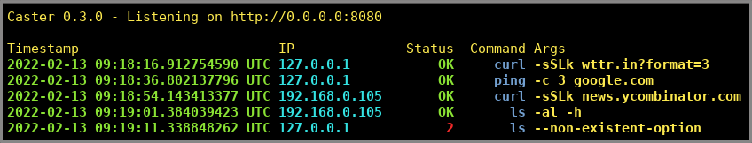

# caster

[](https://crates.io/crates/caster) [](https://hub.docker.com/r/mihaigalos/caster)

Publish local commands and services via http.



# Why?

`caster` can be used for running commands on remote machines, where `ssh` was either not possible (no permissions) or not preferred (principle of least privilege).

# Usage

The server [`docker image`](https://contains.dev/mihaigalos/caster) is `<10MB`.

## Server
```bash
$ docker run --rm -it -p 8080:8080 mihaigalos/caster
```
To avoid i.e. leaking sensitive information such as passwords, you can pass the `--secure` flag. This will only permit access to named endpoints such as `/ping` or `/curl`.

## Client

Test if the remote endpoint can reach the internet:
```bash
$ curl localhost:8080 -XPOST -d 'ping -c 3 google.com'

PING google.com (142.251.36.206): 56 data bytes
64 bytes from 142.251.36.206: seq=0 ttl=117 time=30.143 ms
64 bytes from 142.251.36.206: seq=1 ttl=117 time=19.261 ms
64 bytes from 142.251.36.206: seq=2 ttl=117 time=15.664 ms

--- google.com ping statistics ---
3 packets transmitted, 3 packets received, 0% packet loss
round-trip min/avg/max = 15.664/21.689/30.143 ms
```

Test access, ignore TLS/SSL:
```bash
$ curl localhost:8080 -XPOST -d 'curl -sSLk news.ycombinator.com'

<data>
```

Use remote `jq` service for formatting json:
```bash
$ curl localhost:8080 -XPOST -d 'jq -n {key:"value"}'
```

The following are aliases for the above:
```bash
$ curl localhost:8080/ping -XPOST -d '-c 3 google.com'
$ curl localhost:8080/curl -XPOST -d '-sSLk news.ycombinator.com'
$ curl localhost:8080/jq -XPOST -d '-n {key:"value"}'
```

### Nested curl

curl-ing with another nested `curl` command and passing arguments to it:

```bash
$ curl -s localhost:8080 -XPOST -d 'curl -s localhost:8080 -XPOST -d "jq -n {\"key\":0}"'
{
  "key": 0
}
```
